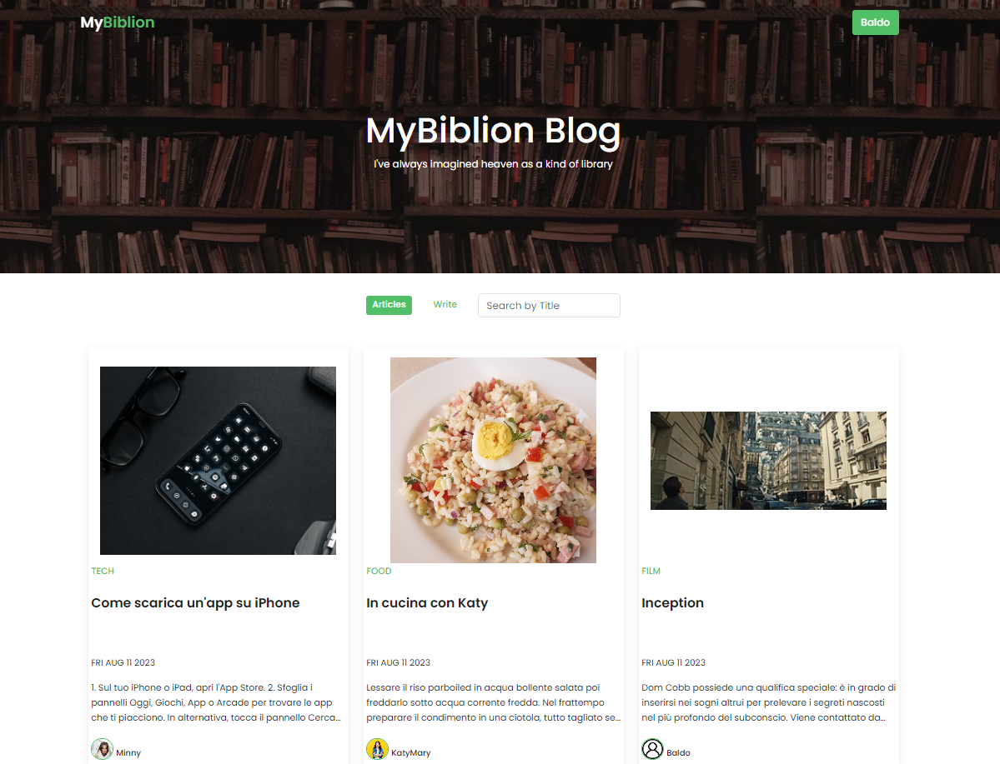
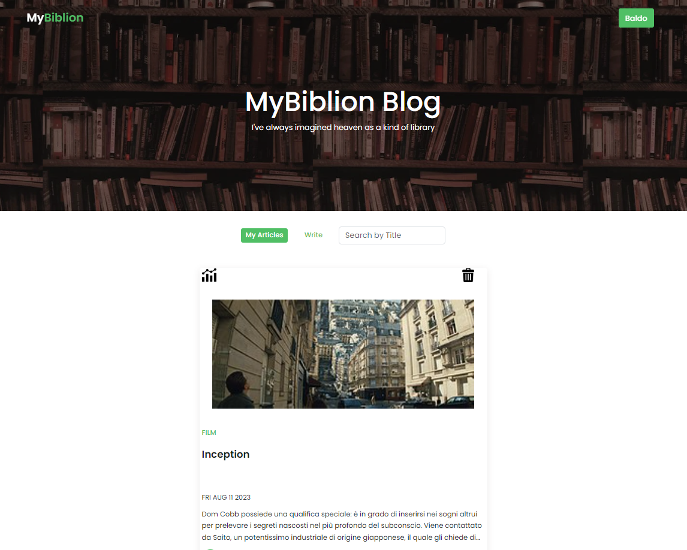
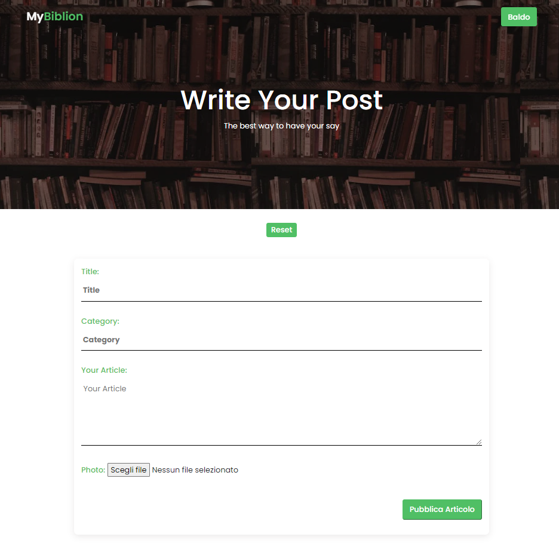
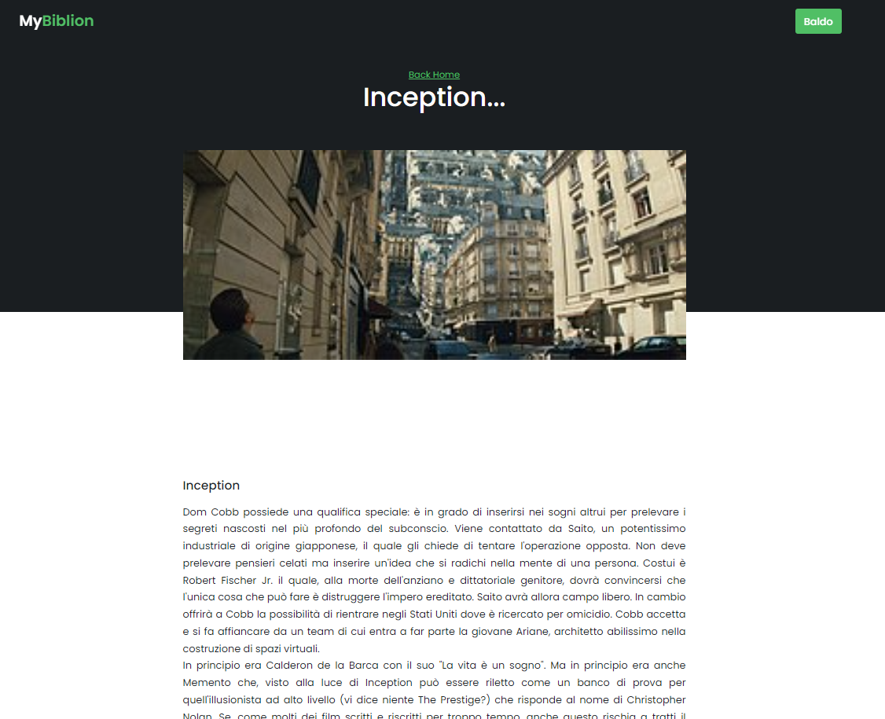
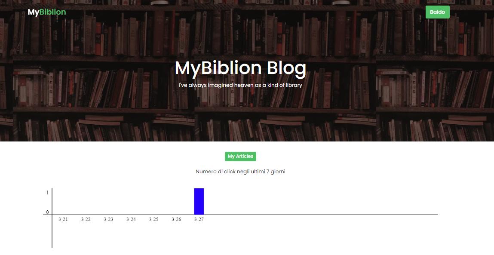

# My Biblion 
> Questo blog online ti permette di pubblicare articoli di qualsiasi genere e di leggere quelli dei tuoi amici.

  
  
  
  
  
  
  

## Come lanciare il sito
* Scaricare il file .zip
* Aprire il terminale 
* Posizionarsi nella directory \backend\
* Lanciare il comando _"npm install"_
* Per avviare il server, lanciare il comando _"npm start"_
* Due possibili opzioni:
  * Tramite cartella: cliccare sul file index.html per avviare il sito
  * Tramite VScode: utilizzando l’estensione Live server

## Schermate del sito

### Pagina di Login / Registrazione

### Home Page

### Profilo Utente

### Scrittura articolo

### Articolo Pubblicato

### Numeri di click sull'articolo

## Struttura del progetto

* index.html: è il file utilizzato da script.js per far visualizzare le varie pagine che l’utente che può selezionare. E’ una specie di contenitore, che in base all’interazione che l’utente ha con la pagina, cambia dinamicamente il suo contenuto. Per evitare errori legati alle cors, nell’head del file sono linkati tutti i file di stile css presente nella directory \styles, che vengono rimossi dallo script.js quando necessario.

* script.js: è il file responsabile della logica del sito. Tramite JQuery manipola il file index.html per effettuare il routing tra le pagine in base alle richieste dell’utente. Parte dal rendering della pagina di Log-In tramite 
funzione ‘load’ di JQuery, e successivamente, tramite metodi di gestione degli eventi di JQuery vengono mostrate le altre pagine

* \styles\login.css: foglio di stile relativo alla pagina login.html
* \styles\style_home_post_page.css: foglio di stile relativo alla home page, alla pagina di un articolo singolo e alla pagina del profilo utente
* \styles\write_post.css: foglio di stile relativo alla pagina per scrivere un articolo
* \src\home_page.html: pagina html relativa alla home page
* \src\login.html: pagina html relativa alla pagina di Log-in / Register
* \src\post_page.html: pagina html relativa alla pagina  di un articolo singolo
* \src\write_post.html: pagina html relativa alla pagina di scrittura di un articolo
* \assets\ : contiene tutte le immagini usate nel sito
* \.vscode\settings.json: file responsabile per disattivare live reload
* \backend\database.js: il file serve ad aprire una connessione con il database usando SQlite
* \backend\server.js: il file è responsabile di far partire il server e gestisce tutte le richieste HTTP che vengono fatte dal client utilizzando la connessione al database
* \backend\db.sql: il file contiene il database, visualizzabile da VScode tramite l’estensione SQlite Viewer
* \backend\package.json: file di configurazione per installare pacchetti con npm
